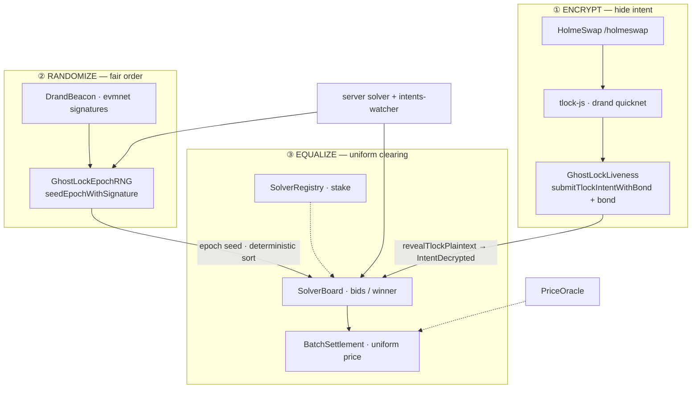
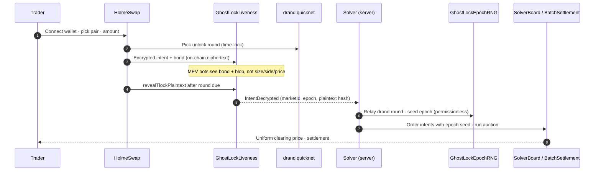

# GhostLock: MEV Reaper   

A stealth shield against MEV, encrypting trades and settling them fair.

## Glance [Sherlock Holmes of DeFi]

| Live | YouTube | Blog |
| --- | --- | --- |
| [Preview](https://ghostlock.vercel.app/) 🟢 | [Demo](https://youtu.be/plceuO9AG8c) 🎥 | [Hashnode](https://randomticks.hashnode.dev/ghostlock-mev-reaper) 📝 |


<!--  -->


## 🛡️ Overview

**ENCRYPT → RANDOMIZE → EQUALIZE** on **Arbitrum Sepolia** (testnet) and **Arbitrum One** (mainnet-ready). HolmeSwap at `/holmeswap` submits encrypted intents to `GhostLockLiveness`. Default ENCRYPT uses **drand quicknet tlock** (`VITE_USE_TLOCK=1`)


## HolmeSwap: 3-prong MEV protection (bird’s-eye)

Three layers stack in order: hide the trade, shuffle fair order, then clear at one price.



**End-to-end path (Arbitrum Sepolia, chain `421614`):**



| Prong | What it stops | Primary contracts / libs |
| --- | --- | --- |
| **ENCRYPT** | Front-running on visible mempool intent | `GhostLockLiveness`, `tlock-js`, drand **quicknet** |
| **RANDOMIZE** | Sandwich via predictable ordering | `DrandBeacon`, `GhostLockEpochRNG`, drand **evmnet** |
| **EQUALIZE** | Price manipulation inside the batch | `SolverBoard`, `BatchSettlement`, `SolverRegistry`, `PriceOracle` |


## What is MEV, anyway?

- In theory, validators control MEV because they decide what goes into a block and in what order. In practice, they outsource the hard work to searchers. Searchers detect MEV opportunities, compete to execute them, and bribe validators via gas fees for inclusion priority. Validators still win because competition forces searchers to hand over most of the profit just to get included.

- **MEV is not “lost” by validators. It is auctioned off.**

```  
┌──────────────┐      observe state       ┌──────────────┐      submit tx + gas bid     ┌──────────────┐     include + order tx     ┌────────────────┐
│  Blockchain  │ ──────────────────────▶  │   Searchers  │ ───────────────────────────▶ │  Validators  │ ─────────────────────────▶ │ Block Execution│
│              │   (state, mempool,       │              │   (priority fee / bribe)     │              │   (tx ordering & inclusion)│                │
│              │    blocks)               │  bots + algos│                              │ block makers │                            │                │
└──────────────┘                          └──────────────┘                              └──────────────┘                            └────────────────┘

```

## Between-Block MEV Problem

| Normal On-chain World | MEV-Distorted World |
| --- | --- |
| Validators extend the chain honestly because future rewards exceed attacking past blocks. | Rewriting history becomes more profitable than extending it. |
| 
```
Block N produced
↓
Block N+1 builds on it
↓
Finality increases
↓
Consensus stable
```
| 
```
Block N contains large MEV
↓
Validator evaluates:
MEV(N) > Reward(N+1)
↓
Reorg becomes profitable
↓
Validator re-mines Block N
↓
Extracts MEV
↓
Original Block N discarded
```
|


## ✨ Key Features

### 3-Layer MEV Protection Strategy

1. **🔒 ENCRYPT (Layer 1)**: Time-locked encryption hides trading intents until unlock (default: **drand quicknet tlock** on HolmeSwap; legacy **blocklock** via dcipher)
2. **🎲 RANDOMIZE (Layer 2)**: Per-epoch seed from **on-chain drand (evmnet)** via `DrandBeacon` + `GhostLockEpochRNG` — fair, verifiable ordering (no privileged VRF fulfiller)
3. **⚡ EQUALIZE (Layer 3)**: Batch auctions with uniform pricing eliminate front-running opportunities and price manipulations.

### Additional Features

- **🤖 Trade Intents Settlement**: Automated solver with AI-optimized clearing prices
- **📊 Transparency Panel**: Gas estimates, unlock block ETA, expected receive amounts via 1inch API
- **💳 Mock ERC-20 Tokens**: ETH, USDC, WETH for development and testing
- **🌐 Multi-Chain**: HolmeSwap cluster on **Arbitrum Sepolia** (`421614`); **Arbitrum One** mainnet cluster pending deploy  


## 🏗️ Architecture

### Frontend (React + TypeScript)
- **Framework**: React 18 with TypeScript
- **Styling**: TailwindCSS with custom design system
- **Animations**: Framer Motion + Three.js for 3D components
- **Web3**: Wagmi + RainbowKit for wallet integration
- **State**: Zustand for client state management

### Backend (Node.js + Express)
- **Runtime**: Node.js with Express framework
- **Blockchain**: Ethers.js for smart contract interaction
- **APIs**: RESTful API design with comprehensive endpoints
- **Solver Service**: Automated batch settlement with epoch seed management (Layer 2)
- **Scheduler**: Proactive epoch seed monitoring and VRF request handling
- **Real-time**: WebSocket support for live updates

### Smart Contracts (Solidity)
- **GhostLockIntents**: Manages encrypted trading intents
- **EpochRNG**: Provides verifiable randomness for fair ordering
- **BatchSettlement**: Handles uniform-price batch auctions
- **MockTokens**: Test tokens for development and testing

**Current HolmeSwap cluster (also see [contracts/README.md](contracts/README.md)):** `GhostLockLiveness`, `DrandBeacon`, `GhostLockEpochRNG`, `SolverBoard`, `BatchSettlement`, `SolverRegistry`, `PriceOracle`.

### Layer 2: EpochRNG Randomization

**Purpose**: Prevents sandwich attacks by randomizing intent execution order using verifiable randomness.

**Current HolmeSwap path:** `DrandBeacon` verifies drand **evmnet** signatures on-chain; anyone may call `GhostLockEpochRNG.seedEpochWithSignature` (no dcipher randomness fee or owner-only fulfiller). The solver or a user can relay the beacon round tied to each epoch anchor.

**How it works** (ordering logic unchanged):
1. Backend solver automatically requests VRF seed from Drand network via EpochRNG contract for each epoch
2. When intents are decrypted (after Layer 1), solver ensures epoch seed exists before processing
3. Intents are grouped by epoch and ordered deterministically using `keccak256(epochSeed || requestId || user)`
4. This creates fair, unbiased sequencing that attackers cannot predict or manipulate
5. Same seed always produces same order → verifiable and deterministic

**Implementation**:
- **Backend**: `solver.js` automatically requests epoch seeds, waits for VRF callback, then orders intents
- **Backend**: `scheduler.js` proactively monitors and pre-requests seeds for upcoming epochs
- **Frontend**: `useEpochRNG` hook reads seeds for display, `useAutoEpochSeedRequest` monitors availability (read-only)
- **Utilities**: `epoch-ordering.ts` provides deterministic comparison functions matching backend logic

**Tackles**:
- ✅ Sandwich attacks (can't predict order to insert front/back-run)
- ✅ Front-running (order is randomized, not first-come-first-served)
- ✅ MEV extraction via sequencing manipulation

## ⚔️ How GhostLock is Different

**Compared to other MEV-resistant efforts, GhostLock stands apart:**

- **Flashbots / SUAVE**  
  - Focus: private mempools + off-chain transaction sequencing.  
  - Limitation: requires trust in relays / builders; opaque order-flow markets.  
  - **GhostLock advantage**: no trusted relay; instead, ciphertexts are *natively encrypted on-chain* and decrypted only after safe block height. No privileged actors.

- **CoW Protocol**  
  - Focus: batch auctions with solver competition.  
  - Limitation: intents visible before clearing → still exploitable; solvers can extract flow.  
  - **GhostLock advantage**: adds **3-layer protection (ENCRYPT + RANDOMIZE + EQUALIZE)**, so intents remain hidden until reveal, then shuffled via VRF to remove sequencing edge, then settled uniformly. GhostLock inherits batch auction fairness but *eliminates pre-reveal leakage and sequencing manipulation*.

- **MEV-Boost / PBS**  
  - Focus: splitting block builders and proposers.  
  - Limitation: improves validator decentralization but not user-level trade protection.  
  - **GhostLock advantage**: *user-first MEV protection*, solving leakage at the transaction level.

- **Secret Network / TEEs**  
  - Focus: hardware-enforced secrecy.  
  - Limitation: trust in hardware enclaves, supply-chain risk.  
  - **GhostLock advantage**: cryptographic, open, and verifiable; no hardware black box.


## ⚠️ Limitations & Edge Cases

- **Decryption timing mismatch**: If unlock block < inclusion block, could allow premature reveal. Mitigation → safety margins + epoch alignment.  
- **Solver centralization**: Current AI call is centralized; roadmap includes **solver marketplace + bond/slashing** to prevent manipulation.  
- **Metadata leakage**: Ciphertext size/timing may leak info. Roadmap → padding + dummy intents.  
- **Latency vs UX tradeoff**: Batch auctions add delay (~minutes). Mitigation → deploy on L2 for faster block times.  
- **Oracle/API dependency**: Reliance on 1inch & external VRF oracles. Add fallback quoting + distributed randomness in roadmap.  


## 🚀 Quick Start

### Prerequisites
- Node.js 18+ and npm


### Installation

1. **Clone the repository**
```bash
git clone https://github.com/your-org/ghostlock-mev-reaper.git
cd ghostlock-mev-reaper
```

2. **Install dependencies**
```bash
# Install root dependencies
npm install

# Install server dependencies
cd server && npm install && cd ..
```

3. **Environment Setup**
```bash
# Copy environment files
cp .env.example .env
cp server/.env.example server/.env

# Update with your configuration
# - Add your WalletConnect Project ID
# - Configure RPC URLs
# - Set contract addresses (after deployment)
```

4. **Start Development Servers**
```bash
# Terminal 1: Start frontend
npm run dev

# Terminal 2: Start backend API
npm run server
```

5. **Access the Application locally**
   
- Frontend: `http://localhost:3000`
- Backend API: `http://localhost:4800`
- Health Check: [Preview](https://ghost-lock-mev-reaper.vercel.app/health)
- Peak the server here 👀: [Preview](https://ghost-lock-mev-reaper.vercel.app/)

## 📋 Smart Contract Deployment

### **Arbitrum Sepolia (Testnet)** — chain `421614`

HolmeSwap and the solver default to this cluster (Sep 2026 deploy). Copy into `.env` / `server/.env` or use the `VITE_ARBITRUM_SEPOLIA_*` keys in [.env.example](.env.example).

| Contract | Address |
| --- | --- |
| [PriceOracle](https://sepolia.arbiscan.io/address/0x86c4023741467c3179683ed152471921DC2D48BC) | `0x86c4023741467c3179683ed152471921DC2D48BC` |
| [SolverRegistry](https://sepolia.arbiscan.io/address/0x3302E3d04d166C6D23E5B09a29a8eE3d2C7Baf98) | `0x3302E3d04d166C6D23E5B09a29a8eE3d2C7Baf98` |
| [DrandBeacon](https://sepolia.arbiscan.io/address/0x74FBA5163505e43634F366c52C92824C23027076) | `0x74FBA5163505e43634F366c52C92824C23027076` |
| [GhostLockEpochRNG](https://sepolia.arbiscan.io/address/0x73A35514Ab9405381A323c513220e20ACb9d7c30) | `0x73A35514Ab9405381A323c513220e20ACb9d7c30` |
| [GhostLockLiveness](https://sepolia.arbiscan.io/address/0x9c3772c9B2E8ae8A074aa9Fc8Aaa4943e0ffC983) | `0x9c3772c9B2E8ae8A074aa9Fc8Aaa4943e0ffC983` |
| [BatchSettlement](https://sepolia.arbiscan.io/address/0x926349E53527f690E25CF9C5d60e8791985aD14E) | `0x926349E53527f690E25CF9C5d60e8791985aD14E` |
| [SolverBoard](https://sepolia.arbiscan.io/address/0xB1A20FFFf4E4e15c0735fc0a79ad8BB8F3909916) | `0xB1A20FFFf4E4e15c0735fc0a79ad8BB8F3909916` |

- [Arbitrum Sepolia Faucet](https://www.alchemy.com/faucets/arbitrum-sepolia)
- Reference quote token (Circle test USDC): `0x75faf114eafb1BDbe2F0316DF893fd58CE46AA4d` — override with `VITE_ARBITRUM_SEPOLIA_USDC_ADDRESS` if needed

### **Arbitrum One (Mainnet)** — chain `42161`

**HolmeSwap 7-contract cluster:** pending deployment. After broadcast, fill `VITE_ARBITRUM_ONE_*` in `.env` and redeploy the frontend.

<details>
<summary>Legacy mainnet addresses (prior stack — not the current HolmeSwap cluster)</summary>

- [GHOSTLOCK_INTENTS](https://arbiscan.io/address/0x2Ad463E1f6783e610504A1027D6AdE8b2DcF10b2) — `0x2Ad463E1f6783e610504A1027D6AdE8b2DcF10b2`
- [EPOCH_RNG](https://arbiscan.io/address/0x96EE446A832b7AdcF598C4B2340131f622677c25) — `0x96EE446A832b7AdcF598C4B2340131f622677c25`

</details>

## Future Roadmap

<!-- - **On-chain verified randomness Intefrations** → Calling the Drand( VRF) verification baked directly into EpochRNG contracts, so ordering proofs are trustless. -->
- Batch auctions with uniform pricing - Solver Competiton board
- **Liveness guarantees** → Bond + slashing for missed reveals, fallback threshold revealers, and permissionless settlement calls so no one can grief the auction.
<!-- - **Privacy hardening** → Add ciphertext(intent) padding, dummy intents, and batch-only publication so metadata leakage doesn’t kill the whole “encrypted” vibe. -->


<!--
## 🔗 Links

- **Documentation**: [docs.ghostlock.io](https://docs.ghostlock.io)
- **Website**: [ghostlock.io](https://ghostlock.io)
- **Twitter**: [@GhostLockDeFi](https://twitter.com/GhostLockDeFi)
- **Discord**: [Join our community](https://discord.gg/ghostlock)
-->

##  Acknowledgments

- [Dcipher Network](https://docs.dcipher.network/quickstart/blocklock/) upholding the permissionless threshold signing network
- [Blocklock Protocol](https://github.com/randa-mu/blocklock-solidity) for time-locked encryption
- [Randomness Protocol](https://github.com/randa-mu/randomness-solidity) for VRF implementation
- [Base](https://base.org) + Arbitrum for the underlying blockchain infrastructure
- [Drand](https://drand.love) for distributed randomness beacon
