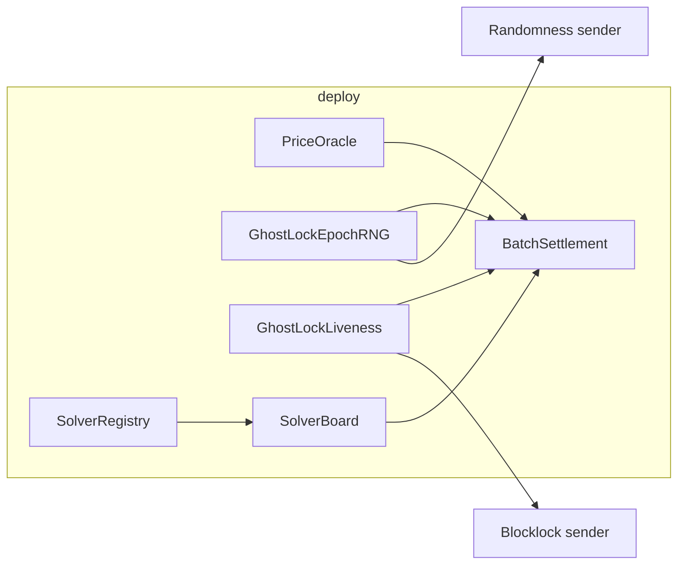

## GhostLock / MEV contracts

Solidity **0.8.34**, **via IR** + optimizer (see `foundry.toml`). Six on-chain modules, deployed and wired by `script/Deploy.s.sol`:

| Contract | Role |
|----------|------|
| **PriceOracle** | Pyth + Chainlink feeds per token; owner adds feeds; used by settlement for price checks. |
| **SolverRegistry** | Solver stake, slashing, settlement records; **authorized caller** must be `SolverBoard` (timelock on later changes). |
| **GhostLockEpochRNG** | Epoch randomness via the randomness sender; owner-managed. |
| **GhostLockLiveness** | Encrypted intents + bonds; talks to **Blocklock** sender; treasury receives slashes; refunds via `call` / `pendingRefunds`. |
| **GhostLockBatchSettlement** | Markets (base/quote ERC-20), batch settlement vs liveness + RNG + oracle; only **SolverBoard** may settle when wired. |
| **SolverBoard** | Batch auction surface (registry + settlement); owner registers batch values before bids. |

Notable behaviors: `GhostLockLiveness` uses pull refunds on failed ETH sends; `SolverBoard` requires `registerBatchValue` before bids; `PriceOracle` can return excess `msg.value` on Pyth updates.

---

## Deployed Contracts

### Arbitrum Sepolia

```
PriceOracle=0x86c4023741467c3179683ed152471921DC2D48BC
SolverRegistry=0x3302E3d04d166C6D23E5B09a29a8eE3d2C7Baf98
DrandBeacon=0x74FBA5163505e43634F366c52C92824C23027076
GhostLockEpochRNG=0x73A35514Ab9405381A323c513220e20ACb9d7c30
GhostLockLiveness=0x9c3772c9B2E8ae8A074aa9Fc8Aaa4943e0ffC983
BatchSettlement=0x926349E53527f690E25CF9C5d60e8791985aD14E
SolverBoard=0xB1A20FFFf4E4e15c0735fc0a79ad8BB8F3909916
```

### IMP Variables

-  https://docs.pyth.network/price-feeds/contract-addresses

```
PYTH_ADDRESS=0x4374e5a8b9C22271E9EB878A2AA31DE97DF15DAF   # Arbitrum Sepolia — Pyth contract on target chain
PYTH_ADDRESS_ARB_MAINNET=0xff1a0f4744e8582DF1aE09D5611b887B6a12925C   # Arbitrum Mainnet
```

- Pyth price IDs: https://pyth.network/price-feeds

```
BASE_PYTH_ID=0xff61491a931112ddf1bd8147cd1b641375f79f5825126d665480874634fd0ace   # ETH/USD
QUOTE_PYTH_ID=0xeaa020c61cc479712813461ce153894a96a6c00b21ed0cfc2798d1f9a9e9c94a  # USDC/USD
```

# dcipher / blocklock (self-hosted)

Operational guide: [docs/DCIPHER-OPS.md](../docs/DCIPHER-OPS.md).

- ARB SEPOLIA CHAIN ID: 421614
- ARB MAINNET CHAIN ID: 42161
- Deploy your own senders from blocklock-solidity / randomness-solidity, or legacy Randamu proxies:

```
BLOCKLOCK_SENDER_ARB_SEPOLIA=0xd22302849a87d5B00f13e504581BC086300DA080     
BLOCKLOCK_SENDER_ARB_MAINNET=0x78ebbbc39f7244bE80C76f11248f5a2645978e25
```

- Dcipher **Randomness sender** contract on Arbitrum seopolia

```
RANDOMNESS_SENDER_ARB_SEPOLIA=0xf4e080Db4765C856c0af43e4A8C4e31aA3b48779    
RANDOMNESS_SENDER_ARB_MAINNET=0x3BF0529293ff2F1901B2f301e56447Dcd56CBaF9
```

## Deploy on Arbitrum Sepolia & Arbitrum One

`Deploy.s.sol` deploys in order: **PriceOracle → SolverRegistry → GhostLockEpochRNG → GhostLockLiveness → GhostLockBatchSettlement → SolverBoard**, then wires `registry.setAuthorizedCaller(board)` and `settlement.setSolverBoard(board)`, registers oracle feeds and one market.

### 1. Environment

Set a **chain-appropriate** RPC (same variable name, different value per network):

```shell
export RPC_URL="https://sepolia-rollup.arbitrum.io/rpc"   # Sepolia
# or Arbitrum One mainnet RPC
```

`foundry.toml` defines `[rpc_endpoints]` aliases `arbitrum_sepolia` / `arbitrum_one` reading `${RPC_URL}` — point `RPC_URL` at the network you are targeting before running the script.

Required env vars (script reads them with `vm.env*`):

| Variable | Purpose |
|----------|---------|
| `DEPLOYER_PK` | Deployer private key (uint). |
| `PYTH_ADDRESS` | Pyth contract on that chain. |
| `BLOCKLOCK_SENDER_ARB_SEPOLIA` | Blocklock sender (**use Arbitrum Sepolia address on Sepolia; use Arbitrum One address on mainnet** — name is historical). |
| `RANDOMNESS_SENDER_ARB_SEPOLIA` | Randomness sender (**same idea: per-chain address**). |
| `TREASURY` | Treasury for liveness slashes / config. |
| `TOKEN_BASE`, `TOKEN_QUOTE` | ERC-20 pair for the first market. On **Arbitrum Sepolia**, quote USDC = Circle test token `0x75faf114eafb1BDbe2F0316DF893fd58CE46AA4d` (not mainnet `0xaf88…5831`). |
| `MARKET_ID` | `uint` market id (e.g. `0`). |
| `BASE_CHAINLINK`, `QUOTE_CHAINLINK` | Chainlink aggregator addresses. |
| `BASE_PYTH_ID`, `QUOTE_PYTH_ID` | `bytes32` Pyth price feed IDs. |
| `BASE_DECIMALS`, `QUOTE_DECIMALS` | Token decimals used by the oracle wiring. |

Deployer needs enough ETH for gas (script asserts `≥ 0.1 ether`).

### 2. Simulate (no broadcast)

```shell
cd contracts
forge script script/Deploy.s.sol:Deploy --rpc-url "$RPC_URL" -vvvv
```

### 3. Broadcast (+ verify)

```shell
forge script script/Deploy.s.sol:Deploy \
  --rpc-url "$RPC_URL" \
  --broadcast \
  --verify \
  --etherscan-api-key "$ETHERSCAN_KEY" \
  -vvvv
```

Use an **Arbiscan** API key for Arbitrum chains. If verification fails, fix `[etherscan]` URLs in `foundry.toml` to match [Arbiscan’s API](https://docs.arbitrum.io/for-devs/developer-tools/block-explorers) for your network.

Resume after a partial broadcast:

```shell
forge script script/Deploy.s.sol:Deploy --rpc-url "$RPC_URL" --broadcast --resume -vvvv
```

### 4. What to do next (after broadcast)

Do these on the **same chain** you deployed to (e.g. Arbitrum Sepolia `421614` or Arbitrum One `42161`).

1. **Save the addresses**  
   The script prints all six contract addresses. Copy them into your app or server config (and keep `broadcast/Deploy.s.sol/<chainId>/run-latest.json` as the source of truth).

2. **Fund the infra contracts with native gas token on that chain**  
   - On **Arbitrum Sepolia**, send **Arbitrum Sepolia ETH** (testnet ETH that lives on chain `421614`, not L1 Sepolia ETH unless you’ve bridged it). Faucets and bridges are chain-specific—use one that credits **Arbitrum Sepolia**.  
   - On **Arbitrum One**, send **Arbitrum ETH** (ETH on `42161`).  
   Send a modest balance to **`GhostLockLiveness`** and **`GhostLockEpochRNG`** so paid blocklock / randomness calls do not fail for lack of balance. (Exact amounts depend on the Blocklock and randomness senders’ fees.)

3. **Optional: move ownership off the deployer**  
   If the deployer EOA should not stay `owner`, call `transferOwnership` on **PriceOracle**, **SolverRegistry**, **GhostLockBatchSettlement**, and **SolverBoard** to a multisig or team wallet (then accept on the new owner where applicable).

4. **Operate the auction stack**  
   The deploy script already wires **SolverRegistry** → authorized caller = **SolverBoard** and **BatchSettlement** → solver board = **SolverBoard**, and registers one market + oracle feeds. Before solvers can bid meaningfully, the **SolverBoard** owner must **`registerBatchValue`** per batch. Add more **`addMarket`** / **`addPriceFeed`** calls if you need extra pairs.

### Market tokens (UI + deploy)

| Network | Chain ID | USDC (Circle) |
| --- | ---: | --- |
| Arbitrum Sepolia | 421614 | `0x75faf114eafb1BDbe2F0316DF893fd58CE46AA4d` |
| Arbitrum One | 42161 | `0xaf88d065e77c8cC2239327C5EDb3A432268e5831` |

Frontend reads balances via `src/holmeswap/contracts/tokens.ts`; override with `VITE_ARBITRUM_SEPOLIA_USDC_ADDRESS` if you deploy a mock quote token.




---

## Testing

From **`contracts/`**. Layout: **`test/unit/`** (focused tests), **`test/integration/`** (multi-contract flows), **`test/invariant/`** (handler + `*.t.sol` invariants), **`test/base/`** (shared `GhostLockFixture` — no standalone tests; covered by callers), **`test/mocks/`** (test doubles — no `*.t.sol`; exercised by unit/integration/invariant).

```shell
# Fast feedback: one layer at a time
forge test --match-path "test/unit/**"
forge test --match-path "test/integration/**"
forge test --match-path "test/invariant/*.t.sol"

# Everything (default + fuzz/invariant settings in foundry.toml)
forge test

# Parallel (tune `-j` to CPU count)
forge test -j8

# Heavier invariant profile (see [profile.invariant_stress] in foundry.toml)
FOUNDRY_PROFILE=invariant_stress forge test --match-path "test/invariant/*.t.sol"
```

## Reference

- Foundry book: https://book.getfoundry.sh/
